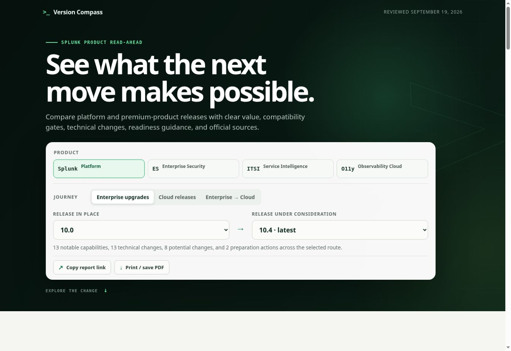
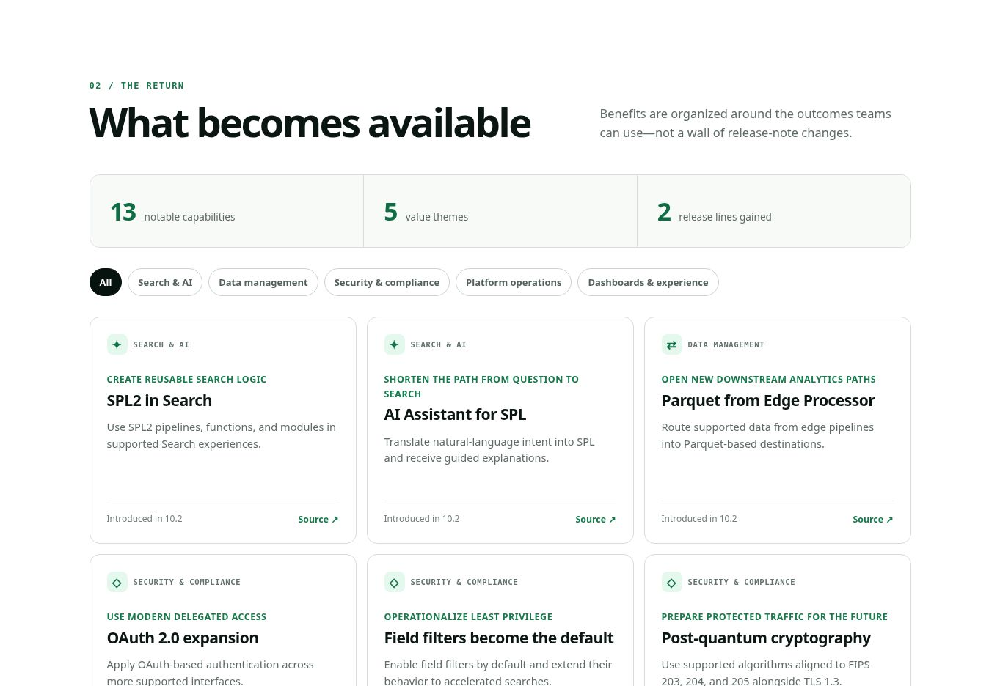

# Version Compass

[](LICENSE)
[](CONTRIBUTING.md)

An interactive, customer-friendly read-ahead for understanding what becomes available—and what preparation is required—across Splunk Platform, Splunk Enterprise Security, Splunk IT Service Intelligence, and Splunk Observability Cloud.

## [Open Version Compass →](https://versioncompass.com)

Choose a product first, then select its deployment context, current release, and destination. The explorer builds a tailored view of:

- Product-aware release journeys for Splunk Platform, Enterprise Security, ITSI, and Observability Cloud
- Supported Splunk Enterprise step-upgrade paths
- Splunk Cloud Platform capability milestones
- Enterprise-to-Cloud readiness gates and migration approaches
- Enterprise Security and ITSI compatibility checks against the selected Splunk platform line
- A direct platform-upgrade route when the selected premium-product target requires Splunk Enterprise to move first
- Dated Observability Cloud milestones with separate OpenTelemetry Collector and instrumentation prerequisites
- Version-aware Splunk Cloud Migration Assessment App (SCMA) guidance
- New features grouped by customer outcome
- A collapsed, route-specific technical delta covering runtimes, data stores, protocols, cryptography, host requirements, APIs, permissions, and operating-model changes
- A dedicated, route-aware view of potential breaking changes, migration blockers, and delay risks
- Release-specific validation work and planning considerations
- Direct links to the relevant official Splunk documentation
- Shareable report URLs that preserve the selected journey and releases
- A print-optimized report that can be saved as PDF from the browser
- Read-only WebMCP tools for agents to discover supported releases and retrieve cited comparisons from the same data

No registration, lead form, subscription, or customer information is collected.

## Screenshots

### Select the upgrade or migration journey



### Explore the value delivered



## Coverage

| Platform | Included releases |
| --- | --- |
| Splunk Enterprise | 8.1 through 10.4 |
| Splunk Cloud Platform | 9.2.2406 through 10.5.2605 |
| Enterprise → Cloud | Enterprise 8.1–10.4 to Cloud 9.2.2406–10.5.2605 |
| Splunk Enterprise Security | 7.3 through 8.7 |
| Splunk IT Service Intelligence | 4.15 through 5.0.2 |
| Splunk Observability Cloud | Dated milestones from November 2024 through September 2026 |

The platform content is organized around five value themes: Search & AI, Platform Operations, Data Management, Security & Compliance, and Dashboards & Experience. Product-specific themes are added for security operations, service intelligence, and observability. A separate technical layer explains the documented before-and-after state, why it matters, and the recommended action without treating every component change as a breaking change. Enterprise-to-Cloud recommendations cover mobilization, assessment, migration-motion selection, app and data preparation, connectivity, access, acceptance testing, cutover, and retirement.

The September 2026 Observability milestone includes customer-managed component guidance through standalone Splunk OpenTelemetry Collector 0.161.0, Kubernetes chart 0.161.0 (which packages Collector 0.161.0), Node.js instrumentation 4.11.0, and Browser RUM 3.1. These versioned components remain distinct from the rolling Observability Cloud service milestone.

See [`docs/product-tracks.md`](docs/product-tracks.md) for the premium-product and Observability model, [`docs/technical-changes.md`](docs/technical-changes.md) for the technical-delta content model, and [`docs/enterprise-to-cloud.md`](docs/enterprise-to-cloud.md) for the migration guidance model, source map, and maintenance notes.

## Release notes

Material changes are summarized by Eastern date in [`docs/releases`](docs/releases/README.md). Each daily note records what changed, why it matters, authoritative sources, and publication status. Scheduled audits do not create empty notes when no material change is found.

## Automated maintenance

Version Compass is maintained through two recurring review cycles:

- A daily release watch checks for newly published versions, maintenance releases, security notices, compatibility changes, and customer-managed component updates.
- A twice-weekly guidance audit rechecks upgrade paths, platform dependencies, recommended actions, citations, links, and report behavior.

When authoritative evidence clearly supports a change, the maintenance workflow updates the relevant site content and documentation, validates representative journeys, commits the reviewed change, and republishes [versioncompass.com](https://versioncompass.com). If the evidence is ambiguous, conflicting, incomplete, or would require an unsupported inference, publication stops and the item is held for human review. No-change runs do not create commits or deployments.

Maintenance validation also covers the shared WebMCP comparison contract and its citations; uncertain findings remain subject to the same human-review stop.

Published maintenance changes are recorded in the [daily release notes](docs/releases/README.md).

## Agent access

Open Version Compass in a WebMCP-capable browser to let an agent list supported releases, compare up to five routes, or read the current report. Results include compatibility warnings, technical changes, readiness work, official citations, review metadata, and shareable links. The tools use the same data and comparison logic as the interface, so scheduled content updates reach both.

This is browser-scoped WebMCP; the site does not expose a standalone remote MCP server endpoint. See [`docs/webmcp.md`](docs/webmcp.md) for tool names, input examples, limitations, and validation.

## Updating for a new release

Platform and Enterprise-to-Cloud content is centralized in [`dist/data.js`](dist/data.js). Premium-product and Observability content lives in [`dist/product-data.js`](dist/product-data.js). To extend the explorer:

1. Add the release identifier to the platform's `releases` array.
2. Add its date, official release-note URL, notable capabilities, technical changes, and readiness requirements under `releasesData`. Set the optional fifth requirement value to `true` when the official source identifies a potential breaking or material behavior change.
3. For Splunk Enterprise, add supported transitions to the `edges` upgrade-path map.
4. For Enterprise Security or ITSI, reconcile the official product compatibility matrix at the maintenance-release level and update the simplified platform-line mapping. Recheck the current Cloud service pairing separately.
5. For Observability Cloud, add a dated service milestone and keep versioned Collector, Kubernetes chart, instrumentation, and semantic-convention dependencies distinct from rolling SaaS availability.
6. Update the applicable `latest` value, the reviewed date, and the reviewed badge's direct link to that date's release note in [`dist/index.html`](dist/index.html).

Each `technicalChanges` record identifies the component or contract, technical area, change type, action level, documented before-and-after state, implication, recommended action, and official source. Preserve important scope distinctions such as bundled versus app-owned, default versus optional, deprecated versus removed, and platform-managed versus customer-managed.

Enterprise-to-Cloud content is kept in the top-level `migration` object. It contains the SCMA compatibility floor, official source links, operating-model benefits, migration approaches, technical operating-model changes, potential breaking changes, and recommended actions. When the latest Cloud destination changes, review both the Cloud release record and migration defaults.

Enterprise Security remains the security-product route even as Splunk expands integrated SIEM, SOAR, UEBA, threat-intelligence, exposure, and AI capabilities. These should be described with their documented edition, deployment, entitlement, and availability boundaries instead of being presented as universally included or as separate top-level version lines without an official version contract.

The selectors, path visualization, metrics, filters, capability cards, collapsed technical delta, breaking-change report, readiness guidance, citations, and shareable URL are generated automatically from that data. The **Print / save PDF** action temporarily includes every value category, expands the technical detail, and uses the browser's native print dialog to create a portable report without sending data to a server.

## Collaboration is welcome

Updates, corrections, and improvements are encouraged—especially:

- New Splunk Platform, Enterprise Security, and ITSI releases, plus Observability Cloud milestones
- Corrected upgrade paths or readiness requirements
- Corrected platform-to-premium-product compatibility or Cloud-managed availability guidance
- Improved Enterprise-to-Cloud assessment, preparation, validation, or cutover guidance
- Additional source-backed technical transitions and clearer implementation actions
- Additional customer-value context backed by official documentation
- Accessibility, responsive-design, and usability improvements
- Clearer language for customer-facing read-aheads

Open an issue to discuss an idea or submit a pull request with the proposed change. Please keep factual additions traceable to official Splunk documentation. Preserve the distinction between customer-managed Enterprise upgrades, Splunk-managed Cloud releases, and an Enterprise-to-Cloud migration program whose final sequence depends on the customer's environment.

See [`CONTRIBUTING.md`](CONTRIBUTING.md) for the content model, workflow, and review checklist.

## Run locally

This is a dependency-free static site. Serve the repository root with any local HTTP server and open `/dist/`:

```bash
python -m http.server 8000
```

Then visit `http://localhost:8000/dist/`.

## Source and scope

The explorer summarizes official Splunk documentation, Splunk Lantern migration guidance, and the supplied product-innovation timeline. It is a planning aid—not a substitute for release notes, compatibility guidance, a Statement of Work, or an environment-specific upgrade or migration plan.

Version Compass is independently developed. It is not affiliated with, sponsored by, endorsed by, or an official product of Cisco or Splunk. Splunk is a Cisco company, and Splunk and related marks are the property of Cisco and/or its affiliates.

## License

Released under the [MIT License](LICENSE). This license covers the project source and original project content; third-party names, trademarks, and linked documentation remain the property of their respective owners.

## Route guidance and historical links

Reports include a cited route takeaway and expandable support lifecycle context. Older valid URLs preserve comparisons and explain relevant changes; unrecognized routes require review. New links carry the guidance review date. See [report guidance](docs/report-guidance.md) for behavior and maintenance.

### Enterprise Security editions

[Compare ES Essentials and Premier](https://versioncompass.com/?view=es-editions), including public-source capability scope, deployment requirements, source questions and a printable report. The older preview links remain compatible.

Agent task guides are checked alongside the aggregate compatibility table. Where minimum versions or pricing eligibility differ, the comparison preserves both cited statements rather than certifying a lower baseline or universal commercial entitlement. See the [September 23 evidence review](docs/releases/2026-09-23.md).
